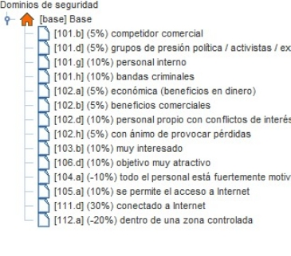

#Auditoría Informática I								PRÁCTICA GRUPO 8

`      `

**AUDITORÍA INFORMÁTICA I**

**Ingeniería Informática 3ºB**

**TRABAJO GRUPO 8:**

**Empresa Broker Castilla y León**

Índice

1. Introducción

1\.1 Enunciado

1\.2 Miembros del Grupo 8

1\.3 Metodología y herramientas

1. Activos
   1. División de Activos
   1. Grafo de Dependencias
   1. Valoración por Activos

1. Amenazas
   1. Factores Agravantes y Atenuantes
   1. Identificación de Amenazas
   1. Valoración de Amenazas
   1. Salvaguardas
   1. Riesgos

1. Conclusión

1. Bibliografía

# 1.Introducción 
## 1.1 Enunciado
*“Empresa broker financiero, ubicado en Castilla y León que ofrece servicios de compra y venta de productos financieros, como fondos indexados, gestión de cartera de acciones, compra y venta de inversiones en bitcoins, la mayor parte de su negocio lo realiza on-line aunque dispone de oficinas físicas en el parque tecnológico de Boecillo en Valladolid, Trabaja con clientes de dentro y fuera de la Unión Europea, y compra y vende productos financieros en las principales bolsas del mundo.”*
## 1.2 Miembros
1. Gabriel Fernández Sacristán.
1. Andrés Marí Piqueras.
1. Marcos Ramos Navarro.
1. Zakarie Laktiouet Saidi.
1. Álvaro González-Barros Medina.
## 1.3 Metodología y herramientas
La intención de este informe es representar la memoria del análisis de riesgos sobre los sistemas IT de una empresa broker financiera. Para ello hemos utilizado la metodología Magerit, utilizada para evaluar y gestionar los riesgos de seguridad en sistemas de información. Se centra en identificar amenazas, evaluar vulnerabilidades y calcular el impacto para desarrollar estrategias de gestión de riesgos. 

Para aplicar esta metodología, se ha utilizado la herramienta Pilar que consiste en un conjunto de herramientas del Entorno de Análisis de Riesgos (EAR), proporcionado por el CCN-CERT. Para tratar el riesgo se proponen:

- Salvaguardas
- Normas de seguridad
- Procedimientos de seguridad

En ella,se evalúan los riesgos en distintas dimensiones, como confidencialidad, integridad, disponibilidad, autenticidad y trazabilidad. Se analiza el riesgo residual a lo largo de diversas fases de tratamiento, integrándose perfectamente con la metodología empleada en este proyecto.

## 
# 2. Activos
A la hora de la identificación de los activos, hemos optado por elegir una serie de servicios fundamentales que debería tener nuestra empresa, y a partir de ahí, hemos incorporado diversos activos necesarios para la ejecución de dichos servicios. 

Además, hemos dividido los activos para facilitar su comprensión y gestión. Teniendo las siguientes capas:

- [P] Personal
- [S] Servicios
- [S\_AC] Servicios Atención Cliente
- [E] Equipamiento
- [HW] Hardware
- [COM] Comunicaciones
- [W\_App] Webs y Aplicaciones
- [L] Instalaciones
- ` `[Serv] Servidores
- [I] Información
## 2.1 [S] Servicios
Estudiando a distintas empresas similares, se han identificado diversos servicios que abarcan una gran variedad de funciones y capas dentro de la empresa. Estos servicios incluyen:

- **[S\_AC\_P] Servicio de Atención al Cliente presencial:** Este servicio se ofrece a través de las oficinas físicas. Los clientes podrían acudir personalmente para recibir asesoramiento, resolver consultas y llevar a cabo transacciones financieras de manera presencial.

- **[S\_AC\_R] Servicio de Atención al Cliente a distancia:** Dado que la mayor parte del negocio se realiza en línea, se ofrece un servicio de atención al cliente a distancia. Esto implica proporcionar soporte, resolver consultas y atender las necesidades de los clientes a través de canales electrónicos, como correo electrónico, chat en línea o teléfono. Para ello la empresa se apoya en una empresa subcontratada especializada en la atención al cliente que pueda atender a nuestros clientes de distintas zonas horarias las 24 horas del día.

- **[S\_Adm] Servicio de Administración:** Este servicio se encargaría de toda la gestión administrativa relacionada con la empresa. Incluiría la administración de cuentas, registros y otros aspectos necesarios para el correcto funcionamiento de las operaciones financieras.

- **[S\_F] Servicio financiero:** La empresa proporciona servicios financieros que abarcan una amplia gama de productos, tales como fondos indexados, gestión de cartera de acciones y compra/venta de inversiones en bitcoins. Este servicio comprende tanto el asesoramiento como la ejecución de operaciones financieras.

- **[S\_Acc]Servicio Compra/Venta de Acciones:** La empresa facilita la compra y venta de acciones en las principales bolsas del mundo, para ello la empresa cuenta con una serie de aplicaciones especializadas para cada tipo de cliente, que se adaptan a las necesidades del usuario.

- **[S\_GC]Servicio de Gestión de Cartera:** los clientes deberían poder llevar a cabo la  diversificación de activos y gestión de sus carteras de inversiones para la adaptación a las condiciones del mercado. Para ello es de vital importancia que la empresa ofrezca en todo momento una aplicación capaz que esté a la altura en todo momento.
## 2.2 [P] Personal
- ` `**[P\_Fin] Personal Financiero:** Este grupo incluiría a profesionales con conocimientos especializados en finanzas. Su labor estaría relacionada con la gestión de inversiones, análisis financiero, toma de decisiones sobre carteras, y el asesoramiento a clientes en temas financieros específicos. 

- ` `**[P\_SC] Personal Servicio al Cliente:** Este personal se encargaría de la interacción directa con los clientes. Sus funciones abarcarían desde brindar información sobre productos y servicios hasta resolver consultas, manejar quejas, y facilitar la ejecución de transacciones. Cabe destacar la distinción entre los empleados presenciales, y los subcontratados que se encargan de la atención a distancia.

- ` `**[P\_O] Personal de Oficina:** Este grupo abarcaría roles administrativos y de apoyo que son esenciales para el funcionamiento diario de la empresa. Incluye funciones como la gestión de documentos, contabilidad, recursos humanos y otras tareas administrativas.

- ` `**[P\_TIC] Personal TIC:** El personal TIC se enfocaría en la gestión y mantenimiento de la infraestructura tecnológica de la empresa. Debido a que gran parte del negocio depende de la tecnología, este personal desempeñaría un papel crucial en la seguridad y la eficiencia de las operaciones.
## 
## 2.3 [E] Equipamiento
- **[HW] Hardware:** engloba todos los componentes físicos utilizados en la infraestructura tecnológica de la empresa. 

  - **[Servidores] Servidores de la empresa:**
    - **[BaseDatos] Sistemas de la gestión de Bases de Datos:** Estos sistemas son responsables de almacenar, organizar y gestionar grandes volúmenes de datos
    - **[Backup] Sistema de Respaldo de Datos:** Este sistema asegura la integridad y disponibilidad de los datos críticos mediante la creación y almacenamiento regular de copias de seguridad

- **[D\_Personales] Dispositivos Personales**
  - **[Móviles] Móviles de empresa:** Estos dispositivos son proporcionados a los empleados para facilitar la comunicación.
  - **[Ordenadores] Ordenadores personales:** ordenadores de escritorio o portátiles que utilizan los empleados para realizar diversas tareas.

- **[COM] Comunicaciones:** esta capa engloba todos los sistemas y canales de comunicación utilizados en la empresa. 

  - **[Tel] Línea de teléfono:**  Es esencial para mantener la conectividad y la comunicación efectiva dentro y fuera de la empresa.
  - **[M-Cif] Mensajería cifrada:** El cifrado protege la información transmitida, siendo especialmente relevante en el intercambio de datos sensibles.
  - **[LAN] Red local oficina:** La red local de oficina conecta los dispositivos y sistemas dentro de la sede física de la empresa. 
  - **[WIFI] Wifi oficina:** Proporciona conectividad inalámbrica en las instalaciones de la empresa.

- **[W\_App] Webs y Aplicaciones:** 

  - **[APP\_CP] App Cliente Particular:** Esta aplicación estaría diseñada específicamente para los clientes particulares. Puede ofrecer funcionalidades como la visualización de carteras, ejecución de transacciones, seguimiento de inversiones y acceso a información financiera personalizada.
  - **[APP\_CE] App Cliente Empresa:** Enfocada en los clientes empresariales, esta aplicación podría proporcionar herramientas específicas, como el seguimiento de cuentas corporativas, análisis de inversiones y otras herramientas adaptadas a las necesidades empresariales.
  - **[APP\_E] App Empresa Interna:** Esta aplicación está orientada al uso interno dentro de la empresa. Puede incluir herramientas para la comunicación entre empleados, acceso a información corporativa entre otras funciones.
  - **[WEB] Web de empresa:** La web puede servir como un portal informativo para clientes y público en general, ofreciendo detalles sobre servicios, información financiera, políticas y otros aspectos relevantes.
## 2.4 [L] Instalaciones
- **[Serv] Servidores:** La empresa cuenta con 3 servidores repartidos por el mundo, ubicados en Asia, Europa y América. La seguridad física y el acceso restringido a estas instalaciones son fundamentales para proteger la integridad y confidencialidad de la información.
- **[Oficina] Oficina Física:** La oficina física, ubicada en el parque tecnológico de Boecillo en Valladolid, proporciona un espacio para operaciones administrativas, atención al cliente presencial, entre otras.
## 2.5 [I] Información
- **[I\_Legal] Información Legal:** Incluye documentos y datos relacionados con la estructura legal y normativa de la empresa. La gestión y seguridad de esta información son fundamentales para cumplir con requisitos legales y normativos, protegiendo la privacidad, evitando sanciones y garantizando la integridad de la empresa.
- **[I\_Clientes] Información Clientes:** Esta categoría engloba datos relacionados con los clientes, como detalles de contacto y otros datos personales. La seguridad y privacidad de esta información son esenciales para construir y mantener la confianza del cliente.
- **[I\_Financiera] Información Financiera:** Contiene datos financieros críticos, como informes contables, balances y registros de transacciones. La integridad de la información financiera es vital para cumplir con las regulaciones financieras.
- **[I\_Empleados] Información Empleados:** Incluye datos relacionados con los empleados, como información personal o detalles de nómina. La protección de la privacidad de los empleados y el cumplimiento de las leyes laborales son de vital importancia.
## 2.6 División de activos

Como se puede comprobar, los archivos esenciales se encuentran en las capas de Servicio e Información, conforme al modelo Magerit.

## 2.7 Dependencias
Una vez identificados todos los activos, procedemos a realizar un grafo de dependencias en el que tomamos las suposiciones sobre qué activo dependía de otro. 

Resultando en el siguiente esquema:

Una vez declaradas las dependencias, realizamos una **valoración por activos**, es decir, sólo se valoran los archivos esenciales (información y servicios), y el resto de activos reciben una valoración en base de sus dependencias.

` `A la hora de la valoración, creímos que la **valoración cualitativa** era la más apropiada. Esta se basa en valorar su importancia en las dimensiones ACIDT.

#     
# 3. Amenazas
Una amenaza se define como una potencial causa de un evento dañino que podría tener un impacto negativo en un recurso vital para la organización. En términos generales, se refiere a cualquier elemento que tenga la capacidad de desencadenar un incidente perjudicial para un activo.

En un proyecto como este, es de vital importancia identificar amenazas que pueden afectar negativamente a los activos de nuestra organización, y tomar las acciones consecuentes para reducir el riesgo.

` `3.1 Factores agravantes y atenuantes

Los factores agravantes y atenuantes son consideraciones importantes en la valoración de riesgos y la gestión de crisis en una empresa broker, ya que pueden influir en la magnitud de los impactos adversos o ayudar a mitigarlos. Hemos considerado los siguientes:

Como podemos apreciar, predominan los factores agravantes debido a la naturaleza de la entidad, de los cuales podemos destacar:

- Al ser una empresa dedicada a la compra/venta de acciones, surge un interés externo por bandas criminales y especuladores por la información privilegiada y los activos que puedan tener en propiedad. 
- Los propios trabajadores pueden vender información o comprar ellos mismos acciones de una empresa en concreto, obteniendo así un rédito económico de forma ilegal.
- Las condiciones económicas globales, crisis financieras o competidores ponen en riesgo a la empresa.

Por otra parte, aun siendo de menor magnitud, cabe destacar los distintos factores atenuantes:

+ La solidez de nuestra infraestructura tecnológica y las grandes capacidades de nuestro personal, mitigan el riesgo de interrupciones y ciberataques.
+ La empresa dispone de conexión a internet dentro de una zona controlada y supervisada para así poder evitar fugas de información o ciberataques.

3\.2 Identificación de las amenazas

A la hora de identificar las amenazas, hemos evitado utilizar la identificación automática que ofrece Pilar aunque se han empleado los criterios y capas estándar del método MAGERIT para la aplicación de amenazas. Estas amenazas las hemos agrupado en 5 distintos grupos:

- **[E] Errores y fallos no intencionados:** Fallos causados por personas de manera involuntaria o accidental. Ejemplo: 

- **[A] Ataques intencionados:** Fallos causados voluntariamente por personas internas o externas a la organización. Ejemplo:

- **[N] Desastres Naturales:** Sucesos que suelen ser de baja probabilidad que ocurren sin intervención de una persona y pueden afectar negativamente a la organización o a un sistema de información de la organización. Ejemplo:

- **[I] De Origen Industrial:** Son fallos que pueden ocurrir tanto de manera accidental como de manera deliberada y tienen un origen industrial. Ejemplo:

- [**PR] Riesgos sobre la privacidad:** Son fallos relacionados con la información privada de los usuarios y demás personas internas de la organización. Ejemplo:

La herramienta PILAR dispone de una lista con una gran cantidad de amenazas posibles, en el proyecto hemos ido observando la lista de amenazas y asignando las amenazas que pueden afectar a ese activo.

3\.3 Valoración de Amenaza

La valoración de riesgos en una empresa que se dedica a intermediar en operaciones financieras, es un proceso crucial para gestionar eficazmente las posibles amenazas que podrían afectar sus operaciones.

Para calcular el riesgo e impacto de un riesgo es necesario valorar las amenazas de nuestro proyecto. Es por ello que optamos por una valoración manual en vez de la automática que ofrece la herramienta, asegurándonos de que la valoración se adapta a la gravedad de cada riesgo.

Aquí presentamos dos activos junto con sus evaluaciones de amenazas, con el propósito de realizar una comparación entre un servicio subcontratado y un servicio interno.

Aunque ambos servicios se encarguen del mismo sector, es notable que al depender una empresa externa, la carencia de control directo y la distancia entre otros factores han influido negativamente en su valoración.

3\.4 Salvaguardas

Una salvaguarda se refiere a un conjunto de acciones o medidas diseñadas para disminuir el riesgo de amenazas contra nuestros activos. Es fundamental que estas salvaguardas evolucionen conforme avanza la complejidad tecnológica de los activos o surgen nuevos elementos que necesitan protección.

Es conveniente conocer a fondo las salvaguardas para así cerciorarse de la protección que tiene el sistema, para ello, el primer paso a realizar en el análisis de salvaguardas es identificar cuáles aplican y cuáles no. 

El programa PILAR evalúa automáticamente el valor de las salvaguardas en función del riesgo que puedan representar. El riesgo relativo aparece representado por el paraguas que se encuentra al lado izquierdo de cada una de las salvaguarda.Si éste es rojo, indica que es el más crítico, y, por otro lado si es gris, denota que son completamente despreciables. Adicionalmente, se muestra la recomendación que proporciona PILAR sobre el nivel al que es aconsejable que se reduzcan estas amenazas.

El cometido con base en las amenazas es determinar el nivel de implementación de la salvaguarda en la columna “current “, y el nivel al que se aspira llegar según el análisis de riesgos en la columna “target”.

Nosotros hemos procurado implementar todas las salvaguardas que, en el ámbito de la empresa broker, consideramos críticas en relación con los activos y las amenazas. Siguiendo la orientación del programa PILAR como referencia, nos centramos de manera 

específica en aquellas que eran altamente sensibles y representaban un riesgo significativo para la empresa.

Por ejemplo, nuestra empresa, se enfrenta a considerables riesgos en el actual entorno empresarial, especialmente en lo que respecta a posibles ataques cibernéticos. Conscientes de esta amenaza, hemos implementado las siguientes salvaguardas:

- [IA.6] El mecanismo de autenticación se inhabilita cuando se ve comprometido o hay sospecha de ello
- [K.IC] Protección de claves de cifra de información [SC-12(2)]
- [AC.3] La gestión de los privilegios de los usuarios del sistema, estará limitada a un número determinado de administradores de sistema y administradores de seguridad
- [COM.C] Protección criptográfica de la confidencialidad de los datos intercambiados [SC-8]

3\.5. Riesgos 

Dado que este proyecto consiste en una auditoría, nuestro objetivo primordial es examinar la situación de la empresa, tanto como los riesgos e impactos a los que se exponen los sistemas de seguridad de la información.

Definimos riesgo como la probabilidad de que una amenaza se materialice en un activo, generando un impacto. Por ende, el riesgo acumulado será reflejo de los impactos acumulados de los activos esenciales, el cual se puede apreciar en el siguiente gráfico:

# 4.  Conclusión
En este informe de auditoría informática, hemos realizado una evaluación exhaustiva de los riesgos asociados a una empresa broker ficticia ubicada en Castilla y León. Este análisis  proporciona a la empresa una base sólida para la toma de decisiones en la gestión de riesgos y la mejora continua de la seguridad. 

Hemos llegado a la conclusión de que la empresa se enfrenta a una gran cantidad de riesgos con consecuencias potencialmente graves, subrayando así la importancia de llevar a cabo una metodología correcta y la aplicación de las medidas de seguridad necesarias para salvaguardar su integridad y continuidad operativa. Adicionalmente, sugerimos que la empresa broker sea proactiva al identificar y reducir riesgos, manteniendo prácticas de monitoreo y actualizando regularmente sus políticas de seguridad. También es importante formar no sólo al personal TIC, sino a la empresa entera, sobre la seguridad cibernética, fortaleciendo así a la empresa ante posibles amenazas, que en conjunto a las medidas anteriormente mencionadas, dan por consecuencia una empresa mejor preparada para protegerse en un entorno empresarial actual.

5\. Bibliografía

PILAR (2023.1.1) Análisis y Gestión de Riesgos (Ayuda).

[Magerit_v3_libro1_metodo](https://cvdof.ucm.es/moodle/pluginfile.php/833539/mod_folder/content/0/Magerit_v3_libro1_metodo.pdf?forcedownload=1)

Magerit\_v3\_libro2\_catálogo de elementos

[Magerit_v3_libro3_guía de técnicas](https://cvdof.ucm.es/moodle/pluginfile.php/833539/mod_folder/content/0/Magerit_v3_libro3_gui%CC%81a%20de%20te%CC%81cnicas.pdf?forcedownload=1)

Auditoría Informática - Módulo 3 - Análisis y Gestión de Riesgos TI

